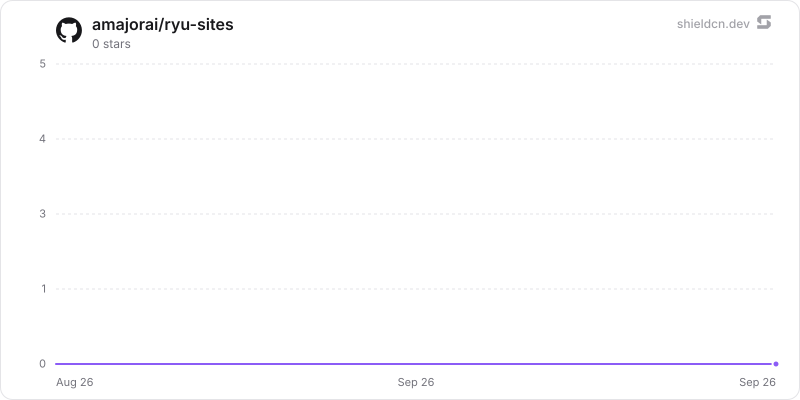

<p align="center">
  <picture>
    <source media="(prefers-color-scheme: dark)" srcset="./icon-dark.png" />
    
  </picture>
</p>

<div align="center">

# Sites

</div>

Create, preview, publish, and share Ryu-powered web experiences through one wildcard public edge.

> **The public home of `ryu-sites`.** Source, builds, and releases live here —
> binaries for every platform are attached to each release.
>
> This tree is generated from the Ryu monorepo, so commits pushed here
> directly are replaced on the next sync. **Pull requests are welcome** —
> open them here and they are ported into the monorepo, then flow back out.
> Ryu as a whole: https://github.com/amajorai/ryu

## Install

**App:** [Install](ryu://apps/@ryu/sites) (opens the Ryu desktop app and asks you to confirm)

**CLI:**

```bash
ryu apps add @ryu/sites
```

## Source & build

The **source of record** for this app: a dependency-free Bun/TypeScript
`sidecar/` Ryu runs locally as a grant-gated control capability, plus the
manifest `ui/`. The sidecar builds standalone — `cd sidecar && bun install &&
bun run build` compiles a single `ryu-sites` executable; each release attaches
the per-platform binaries.

## License

Apache-2.0 — see [LICENSE](./LICENSE).

## Build and verify

From the Ryu workspace:

```sh
bun run --cwd apps-store/sites/sidecar build
bun run --cwd apps-store/sites/ui build
bun run --cwd apps-store/sites/sidecar test
bun run --cwd apps-store/sites/ui test
```

The sidecar build regenerates the browser runtime from the shared browser data
primitives. The source Companion bundles the existing Ryu controls and App UI layouts.

## Operator configuration

Use the Core-minted `RYU_EXT_TOKEN` and injected `RYU_SITES_PORT` under normal lifecycle
management. Standalone tests can use `RYU_SITES_TOKEN`. Store data beneath an isolated
`RYU_DIR` with `RYU_PROFILE=dev` and `RYU_KEYCHAIN=off` for unattended testing.

- `RYU_SITES_PUBLIC=1` enables the public audience; the default is disabled.
- `RYU_SITES_VISITOR_PORT` selects the separate loopback visitor listener.
- `RYU_SITES_DOMAIN` selects the managed suffix; the local default is `localhost`.
- `RYU_SITES_ISSUER`, `RYU_SITES_CLIENT_ID` and optional `RYU_SITES_CLIENT_SECRET`
  connect a registered platform OIDC client. Register each callback origin at the
  identity provider. `RYU_SITES_OWNER_ID` must match the verified owner subject.
- The injected `RYU_CORE_PORT` and app-only extension token connect Core host primitives.
  `RYU_SITES_BINDINGS_FILE` names an operator-owned JSON object mapping site IDs to
  arrays of approved Space IDs. The `spaces:docs` host grant must be approved in Ryu. On a managed node, `RYU_SITES_OWNER_JWT` supplies a verified owner identity and must be refreshed before it expires.
  Removing a binding denies subsequent retrieval even if the site still selects it.

These values are process wiring, not part of a public site artifact. Never put them
in prompts or generated HTML. The public guide describes supported behavior without
exposing this operational wiring.

## Current evidence boundary

The browser proof harness runs the built Companion with a real persistent sidecar,
using a test-only loopback adapter for the generic host bridge. It is not a real
Desktop host, external OIDC, managed edge, DNS/TLS or live model-provider proof.
The local runtime supports self-contained HTML and its scoped data APIs; arbitrary
server frameworks, hosted secret execution and managed relay provisioning still need
additional runtime integration before claiming full ChatGPT Sites parity.

## Star History

<a href="https://github.com/amajorai/ryu-sites/stargazers">
  <picture>
    <source media="(prefers-color-scheme: dark)" srcset="./.github/shieldcn/star-chart-dark.svg" />
    
  </picture>
</a>
