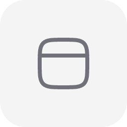

<p align="center">
  <picture>
    <source media="(prefers-color-scheme: dark)" srcset="./icon-dark.png" />
    
  </picture>
</p>

<div align="center">

# Sites

</div>

Create, preview, publish, and share Ryu-powered web experiences through one wildcard public edge.

> **The public home of `ryu-sites`.** Source, builds, and releases live here —
> binaries for every platform are attached to each release.
>
> This tree is generated from the Ryu monorepo, so commits pushed here
> directly are replaced on the next sync. **Pull requests are welcome** —
> open them here and they are ported into the monorepo, then flow back out.
> Ryu as a whole: https://github.com/amajorai/ryu

## Install

**App:** [Install](ryu://apps/@ryu/sites) (opens the Ryu desktop app and asks you to confirm)

**CLI:**

```bash
ryu apps add @ryu/sites
```

## Source & build

This is the **source of record** for the app UI. It imports Ryu's private
`@ryu/ui` design system, so it does **not** build standalone outside the
monorepo — it **builds inside the amajorai/ryu monorepo workspace**.
The **shipped bundle below is the built artifact**: a prebuilt single-file
companion bundle is included at [`dist/sites.ui.html`](./dist/sites.ui.html) —
the runnable UI Ryu loads for this app.

## License

Apache-2.0 — see [LICENSE](./LICENSE).

## What this slice shows

- A typed `SiteProject`, `SiteDeployment`, `SiteDomain`,
  `PublicEdgeConnector`, and `PublicEdgeRoute` model.
- A wildcard managed URL preview under `*.sites.ryu.app`.
- Explicit Preview, BYO relay, and Managed Ryu Edge delivery states.
- Connector and route-lease status without creating a network connection.
- Domain verification states where **Live** is reserved for an active DNS and
  TLS binding.
- Explicit quota cards for published Sites, connectors, build minutes, storage,
  bandwidth, visitors, and custom domains.
- A local Help Center widget preview with Ask, Help, and Contact navigation.
- A copyable widget script containing only the managed Site origin and a public
  site key. Node tokens, Cloudflare credentials, Space ids, and deployment
  secrets are never rendered or copied.

All records are deterministic demo data. The companion has no runtime network
dependency and does not publish, provision a connector, validate DNS, or claim
that any URL is live.

## Build and test

```sh
bun run --cwd apps-store/sites/ui test
bun run --cwd apps-store/sites/ui check-types
bun run --cwd apps-store/sites/ui build
```

The build emits one self-contained `ui/dist/index.html` with styles and code
inlined for the companion host.
